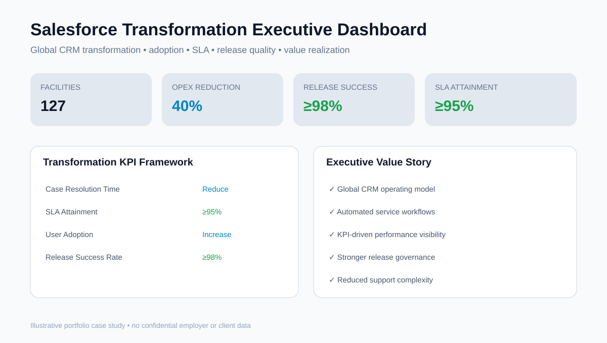
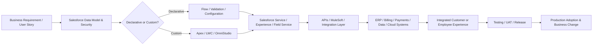

# Salesforce Multi-Cloud Development & Transformation Portfolio

A recruiter-facing portfolio demonstrating **hands-on Salesforce development and enterprise program/project leadership** across platform engineering, field service, customer service, portals, Salesforce Industries, data, integrations, releases, adoption and value realization.



## Hands-On Salesforce Capability

This portfolio reflects experience working directly with Salesforce delivery teams and platform capabilities including:

- Apex classes, triggers and server-side business logic
- Lightning Web Components (LWC) and Lightning user experiences
- Salesforce Flow and declarative automation
- SOQL and Salesforce data access patterns
- OmniStudio, OmniScript and Integration Procedures
- Enterprise Product Catalog / product configuration
- validation rules, permissions, objects, fields and metadata configuration
- API and enterprise-system integrations
- MuleSoft integration patterns
- Data Cloud and customer-data integration
- data migration and reconciliation
- automated and manual testing, UAT, defect management and production readiness
- source control, CI/CD and release/deployment governance

## How a Salesforce Project Is Actually Built — From Code to Business Change

A Salesforce transformation becomes real when business requirements are translated into platform metadata, automation, code, integrations and data changes that can be safely promoted into production. My program-leadership approach is grounded in understanding that engineering lifecycle rather than treating Salesforce as a black-box SaaS implementation.

### 1. Business process becomes technical requirements
A project starts with the current-state workflow: who performs the work, what data is used, which approvals are required, where handoffs fail and what outcome the new platform must produce. Those requirements become **epics, features, user stories, acceptance criteria, process maps, integration requirements and non-functional requirements**.

The solution team then determines which capabilities should be handled declaratively and which require custom engineering:

- **Objects / fields / relationships** define the data model.
- **Permission sets, sharing and security rules** control who can see and do what.
- **Salesforce Flow** handles configurable workflow and automation where code is unnecessary.
- **Apex classes and triggers** implement server-side logic when requirements exceed declarative capabilities.
- **Lightning Web Components** create custom user interfaces and experiences using HTML, JavaScript and Salesforce services.
- **SOQL** retrieves Salesforce data required by application logic.
- **OmniStudio / OmniScript / Integration Procedures** orchestrate guided experiences and industry workflows.
- **APIs / MuleSoft** connect Salesforce to ERP, billing, payment, identity, data, cloud and external operational systems.

Salesforce's own developer documentation describes Apex as its typed object-oriented server-side language, Lightning Web Components as its framework for custom web experiences, and Salesforce DX/CLI with VS Code and sandbox/scratch-org workflows as a recommended modern development model.

### 2. Architecture defines how the pieces interact
Before the sprint team writes code, architects and technical leads establish the solution pattern: Salesforce objects, data ownership, system-of-record boundaries, integration direction, API contracts, event handling, authentication, error handling, performance expectations and security controls.

A typical enterprise solution can be represented as:



The diagram illustrates why Salesforce program delivery is both a software-engineering and transformation discipline: a change to one workflow can involve code, metadata, APIs, data mappings, security, downstream systems, testing and operational adoption.

### 3. Developers build in controlled environments
Development is performed in controlled Salesforce environments rather than directly in production. Engineers typically use **VS Code, Salesforce CLI/DX, Git/source control and development or sandbox orgs**.

A developer may create or modify:

- Apex classes and triggers
- Lightning Web Components
- Flows and subflows
- custom objects and fields
- permission sets and sharing configuration
- validation rules
- OmniStudio assets
- API services and integration mappings
- test classes and test data
- deployment metadata

Work is associated back to the Agile story and acceptance criteria so technical delivery remains traceable to the business requirement.

### 4. Integration turns Salesforce into an enterprise platform
In large organizations, Salesforce rarely operates alone. The value of the platform comes from connecting customer, operational and transaction workflows across systems.

An example transaction may look like this:

**Customer action → Experience/Service Cloud → Flow or LWC → Apex/business logic → MuleSoft/API → ERP/billing/payment platform → response returned to Salesforce → case/customer record updated → notifications and downstream analytics triggered.**

This requires program coordination across Salesforce developers, integration engineers, data teams, cybersecurity, enterprise architecture, external vendors and business owners. Integration delivery also requires API contracts, authentication, data mappings, retries, error queues, monitoring, reconciliation and clear system-of-record ownership.

### 5. Code must be tested before it changes the business
A completed feature moves through increasingly broader levels of validation:

1. developer/unit testing
2. Apex automated tests and code-quality checks
3. integration testing
4. system integration testing (SIT)
5. regression testing
6. user acceptance testing (UAT)
7. security and performance validation where required
8. release-readiness review

Defects are triaged back to the responsible team, retested and closed against agreed acceptance criteria. This is where strong program controls matter: code completion does not equal business readiness.

### 6. CI/CD moves approved changes toward production
Source-controlled Salesforce metadata and code are promoted through environments using a governed release process. Depending on the enterprise, this can involve **Salesforce CLI, DevOps Center, Copado or other CI/CD tooling**, pull requests, automated validation, test execution and release gates.

The goal is repeatability and traceability: leadership should be able to understand **what changed, why it changed, who approved it, what dependencies exist, what tests passed and how the release can be recovered if an issue occurs**.

### 7. Deployment creates the technical change; adoption creates the business change
After deployment, the program still has work to do. Users need the right permissions, migrated data must reconcile, integrations must be monitored, support teams need runbooks, adoption has to be measured and production issues must be resolved during hypercare.

The real transformation occurs when the new Salesforce capability changes how people work—for example:

- a service representative sees a consolidated customer history instead of searching multiple systems
- a field technician receives work orders, asset information and scheduling through Field Service
- a customer uses an Experience Cloud portal instead of calling a contact center
- an Agentforce or Einstein capability recommends or executes the next best action
- a workflow that required emails and spreadsheets is automated through Flow and integrated services

This is the bridge between **software delivery and measurable operating change**.

## Salesforce Cloud / Platform Coverage

| Platform / Cloud | Representative Experience |
|---|---|
| **Service Cloud** | Customer/service workflow modernization, SLA and service KPI visibility |
| **Field Service Lightning / Salesforce Field Service** | Workforce scheduling, field workflows, asset management, Flow and Apex automation |
| **Experience Cloud / Community Cloud** | Customer and partner portal delivery, including global implementations |
| **Marketing Cloud** | Customer engagement, campaign and communications delivery integrated with CRM programs |
| **Salesforce Industries / Vlocity** | OmniStudio, OmniScript, Integration Procedures, EPC, product configuration and business rules |
| **Salesforce Data Cloud** | Customer/data unification and analytics-oriented transformation |
| **Salesforce Platform** | Apex, Lightning, Flow, SOQL, custom automation, integrations and enterprise application delivery |
| **Einstein / Agentforce** | AI-assisted and agentic CRM workflows, decision support and customer-service automation |

> The portfolio distinguishes Salesforce clouds/platform capabilities from supporting products and tools; integrations such as MuleSoft, payment platforms and document automation are not presented as separate Salesforce clouds.

## Selected Enterprise Delivery Experience

### Salesforce Technical Program Management — 2018–2022
Led enterprise Salesforce delivery spanning development, integration, architecture coordination and program execution. Work included Field Service Lightning implementations using **Salesforce Flow and Apex**, plus integrations with **AWS, Azure and Google Cloud** supporting payments, workforce scheduling and asset management.

### Global CRM Transformation — 127 Facilities
Directed a scalable Salesforce CRM operating model across **127 facilities**, balancing global standards with regional requirements. Focus areas included workflow automation, governance, configuration standards, KPI visibility, release management, adoption and operating efficiency.

### Entergy / ComTec — Agile Multi-Cloud Customer Platform
Led end-to-end Agile delivery across **Service Cloud, Experience / Community Cloud and Marketing Cloud**, supporting a large-scale customer platform and grooming/refining **2,500+ user stories**. Delivery spanned discovery, backlog formation, architecture/development coordination, integrations, sprint execution, SIT/UAT, cutover, deployment, stabilization and adoption.

### JLL — Global Community / Experience Cloud
Delivered Salesforce Community Cloud / Experience Cloud capabilities across **AMER, EMEA and APAC**, coordinating regional requirements, delivery teams, testing and rollout.

### Salesforce Industries / Vlocity — Connected Living
Supported Connected Living capabilities using **OmniStudio, OmniScript, Integration Procedures, Enterprise Product Catalog, business rules, pricing and product configuration**, with integration to broader customer and enterprise platforms.

### Enterprise Salesforce Integrations
Led Salesforce-to-ERP and enterprise integration programs across major organizations and industries, coordinating requirements, APIs, data migration, integration testing, UAT, cutover and production readiness.

### Payments & Document Automation
Delivered Salesforce ecosystem improvements using integrated payment-processing and document-generation capabilities to replace legacy workflows and improve CRM process efficiency.

## Development + Program Management Operating Model

My Salesforce approach connects hands-on platform knowledge with disciplined enterprise delivery:

1. **Discovery & requirements** — business processes, personas, requirements, user stories and acceptance criteria
2. **Architecture & design** — Salesforce capabilities, integrations, data, security and non-functional requirements
3. **Development** — Apex, Flow, LWC, OmniStudio and integration delivery
4. **Agile execution** — backlog, sprint planning, dependency management, demos and stakeholder decisions
5. **Testing** — SIT, UAT, defect governance, data validation and regression readiness
6. **Release** — source control, CI/CD, deployment planning, cutover, release gates and production readiness
7. **Adoption** — training, change management, support transition and usage KPIs
8. **Value realization** — SLA, adoption, operating cost, customer outcomes and executive KPI reporting

## Salesforce Ecosystem & Dreamforce

My Salesforce experience has developed over roughly a decade of engagement with the broader Salesforce ecosystem—following the platform's evolution from cloud CRM into a multi-cloud, data, integration and now agentic-AI enterprise platform. That long-term perspective includes the product direction and innovation showcased through **Dreamforce**, Salesforce's flagship annual conference, and the strategic vision communicated by Salesforce Chair, CEO and Co-Founder **Marc Benioff**.

This should not be read as a claim of a personal relationship with Marc Benioff; rather, it reflects sustained professional engagement with the Salesforce ecosystem and its product evolution over approximately ten years.

- **Salesforce:** https://www.salesforce.com/
- **Salesforce Developers:** https://developer.salesforce.com/
- **Dreamforce:** https://www.salesforce.com/dreamforce/

## What This Project Demonstrates

- Hands-on Salesforce development literacy
- Understanding of how Apex, LWC, Flow, metadata, APIs and data combine into working enterprise solutions
- Multi-cloud Salesforce delivery
- Salesforce development-team and vendor leadership
- Architecture and integration coordination
- Agile / Scrum / SAFe program execution
- Source control, CI/CD and release governance
- Roadmap, budget, risk and dependency management
- Data migration, testing, UAT and production readiness
- Executive reporting and KPI design
- Global rollout and adoption leadership
- Ability to translate business strategy into code, configuration, integrations and measurable operating change

## Executive KPIs

- Case resolution time
- SLA attainment
- User adoption
- Release success rate
- Defect leakage
- Automation rate
- Integration reliability
- IT OPEX
- Business value realization

## Run the Dashboard

```bash
pip install -r requirements.txt
streamlit run app.py
```

## Repository Structure

- `app.py` — interactive Streamlit executive dashboard
- `assets/dashboard-preview.svg` — visual dashboard preview
- `governance/program_charter.md` — transformation charter and operating model
- `governance/release_readiness.md` — release-readiness framework
- `metrics/kpi_framework.csv` — KPI definitions, owners, cadence and targets

## Target Roles

This portfolio is designed to support opportunities including **Salesforce Technical Program Manager, Salesforce Program Manager, Salesforce Delivery Leader, CRM Transformation Director, Salesforce Product/Platform Leader, Enterprise Applications Program Manager and Technology Transformation Leader**.

> This repository is a professional portfolio case study. Illustrative or synthetic metrics are used where appropriate, and no confidential employer or client data is included.
